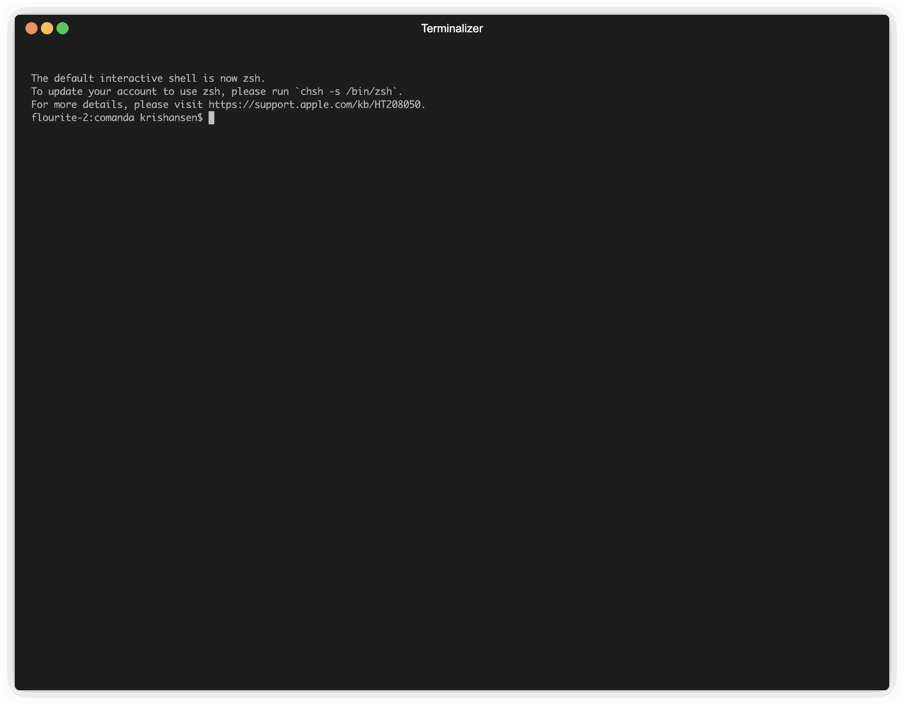

# COMandA (Chain of Models and Actions)



COMandA is a command-line tool that enables the composition of Large Language Model (LLM) operations using a YAML-based Domain Specific Language (DSL). It simplifies the process of creating and managing agentic workflows composed of downloads, files, text, images, documents, multiple providers and multiple models.

Think of each step in a YAML file as the equivalent of a Lego block. You can chain these blocks together to create more complex structures which can help solve problems.

Create YAML 'recipes' and use `comanda process` to execute the recipe file.

COMandA allows you to use the best provider and model for each step and compose information pipelines that combine the stregths of different LLMs. It supports multiple LLM providers (OpenAI, Anthropic, Google, X.AI, Ollama) and provides extensible DSL capabilities for defining complex information workflows.

## Features

- 🔗 Chain multiple LLM operations together using simple YAML configuration
- 🤖 Support for multiple LLM providers (OpenAI, Anthropic, Google, X.AI, Ollama)
- 📄 File-based operations and transformations
- 🖼️ Support for image analysis with vision models (screenshots and common image formats)
- 🌐 Direct URL input support for web content analysis
- 🕷️ Advanced web scraping capabilities with configurable options
- 🛠️ Extensible DSL for defining complex workflows
- ⚡ Efficient processing of LLM chains
- 🔒 HTTP server mode: use it as a multi-LLM workflow wrapper
- 🔐 Secure configuration encryption for protecting API keys and secrets
- 📁 Multi-file input support with content consolidation
- 📝 Markdown file support for reusable actions (prompts)
- 🗄️ Database integration for read/write operations for inputs and outputs

## Installation

### Download Pre-built Binary

The easiest way to get started is to download a pre-built binary from the [GitHub Releases page](https://github.com/kris-hansen/comanda/releases). Binaries are available for:
- Windows (386, amd64)
- macOS (amd64, arm64)
- Linux (386, amd64, arm64)

Download the appropriate binary for your system, extract it if needed, and place it somewhere in your system's PATH.

### Install via Go

```bash
go install github.com/kris-hansen/comanda@latest
```

### Build from Source

```bash
git clone https://github.com/kris-hansen/comanda.git
cd comanda
go build
```

## Configuration

### Environment File

COMandA uses an environment file to store provider configurations and API keys. By default, it looks for a `.env` file in the current directory. You can specify a custom path using the `COMANDA_ENV` environment variable:

```bash
# Use a specific env file
export COMANDA_ENV=/path/to/your/env/file
comanda process your-dsl-file.yaml

# Or specify it inline
COMANDA_ENV=/path/to/your/env/file comanda process your-dsl-file.yaml
```

### Configuration Encryption

COMandA supports encrypting your configuration file to protect sensitive information like API keys. The encryption uses AES-256-GCM with password-derived keys, providing strong security against unauthorized access.

To encrypt your configuration:
```bash
comanda configure --encrypt
```

You'll be prompted to enter and confirm an encryption password. Once encrypted, all commands that need to access the configuration (process, server, configure) will prompt for the password.

Example workflow:
```bash
# First, configure your providers and API keys
comanda configure

# Then encrypt the configuration
comanda configure --encrypt
Enter encryption password: ********
Confirm encryption password: ********
Configuration encrypted successfully!

# When running commands, you'll be prompted for the password
comanda process your-dsl-file.yaml
Enter decryption password: ********
```

The encryption system provides:
- AES-256-GCM encryption (industry standard)
- Password-based key derivation
- Protection against tampering
- Brute-force resistance

You can still view your configuration using:
```bash
comanda configure --list
```
This will prompt for the password if the configuration is encrypted.

### Provider Configuration

Configure your providers and models using the interactive configuration command:

```bash
comanda configure
```

This will prompt you to:

1. Select a provider (OpenAI/Anthropic/Google/X.AI/Ollama)
2. Enter API key (for OpenAI/Anthropic/Google/X.AI)
3. Specify model name
4. Select model mode:
   - text: For text-only operations
   - vision: For image analysis capabilities
   - multi: For both text and image operations

You can view your current configuration using:

```bash
comanda configure --list                       
Server Configuration:
Port: 8080
Data Directory: data
Authentication Enabled: true

Configured Providers:

anthropic:
  - claude-3-5-latest (external)

google:
  - gemini-pro (external)

ollama:
  - llama3.2 (local)

openai:
  - gpt-4o-mini (external)
  - gpt-4o (external)

xai:
  - grok-beta (external)
```

To remove a model from the configuration:

```bash
comanda configure --remove <model-name>
```

To update an API key for a provider (e.g., after key rotation):

```bash
comanda configure --update-key=<provider-name>
```

This will prompt you for the new API key and update it in the configuration. For example:

```bash
comanda configure --update-key=openai
Enter new API key: sk-...
Successfully updated API key for provider 'openai'
```

When configuring a model that already exists, you'll be prompted to update its mode. This allows you to change a model's capabilities without removing and re-adding it.

Example configuration output:

``` yaml
Server Configuration:
Port: 8080
Data Directory: data
Authentication Enabled: false

Database Configurations:

mydatabase:
  Type: postgres
  Host: localhost
  Port: 5432
  User: myuser
  Database: mydatabase

Configured Providers:

xai:
  - grok-beta (external)
    Modes: text

anthropic:
  - claude-3-5-sonnet-latest (external)
    Modes: text, file
  - claude-3-5-haiku-latest (external)
    Modes: text, file
  - claude-3-5-sonnet-20241022 (external)
    Modes: text, file

google:
  - gemini-pro (external)
    Modes: text
  - gemini-1.5-pro (external)
    Modes: text, file, vision
  - gemini-1.5-flash (external)
    Modes: text, multi, file
  - gemini-1.5-flash-8b (external)
    Modes: text, vision, multi, file

ollama:
  - llama3.2 (local)
    Modes: text
  - llama2 (local)
    Modes: text

openai:
  - gpt-4o-mini (external)
    Modes: text, file
  - gpt-4o (external)
    Modes: text, vision
  - gpt-4o-2024-11-20 (external)
    Modes: text, vision, multi, file
```

### Server Configuration

COMandA can run as an HTTP server, allowing you to process chains of models and actions defined in YAML files via HTTP requests. The server is managed using the `server` command:

```bash
# Start the server
comanda server

# Configure server settings
comanda server configure        # Interactive configuration
comanda server show            # Show current configuration
comanda server port 8080       # Set server port
comanda server datadir ./data  # Set data directory
comanda server auth on         # Enable authentication
comanda server auth off        # Disable authentication
comanda server newtoken       # Generate new bearer token
```

The server configuration is stored in your `.env` file alongside provider and model settings:

```yaml
server:
  port: 8080
  data_dir: "examples"  # Directory containing YAML files to process
  bearer_token: "your-generated-token"
  enabled: true  # Whether authentication is required
```

To start the server:

```bash
comanda server
```

The server provides the following endpoints:

### 1. Process Endpoint

`GET /process` processes a YAML file from the configured data directory. For YAML files that use STDIN as their first input, `POST /process` is also supported.

#### GET Request
```bash
# Without authentication
curl "http://localhost:8080/process?filename=openai-example.yaml"

# With authentication (when enabled)
curl -H "Authorization: Bearer your-token" "http://localhost:8080/process?filename=openai-example.yaml"
```

#### POST Request (for YAML files with STDIN input)
You can provide input either through a query parameter or JSON body:

```bash
# Using query parameter
curl -X POST "http://localhost:8080/process?filename=stdin-example.yaml&input=your text here"

# Using JSON body
curl -X POST \
  -H "Content-Type: application/json" \
  -d '{"input":"your text here"}' \
  "http://localhost:8080/process?filename=stdin-example.yaml"
```

Note: POST requests are only allowed for YAML files where the first step uses "STDIN" as input. The /list endpoint shows which methods (GET or GET,POST) are supported for each YAML file.

Response format:
```json
{
  "success": true,
  "message": "Successfully processed openai-example.yaml",
  "output": "Response from gpt-4o-mini:\n..."
}
```

Error response:
```json
{
  "success": false,
  "error": "Error message here",
  "output": "Any output generated before the error"
}
```

### 2. List Endpoint

`GET /list` returns a list of YAML files in the configured data directory, along with their supported HTTP methods:

```bash
curl -H "Authorization: Bearer your-token" "http://localhost:8080/list"
```

Response format:
```json
{
  "success": true,
  "files": [
    {
      "name": "openai-example.yaml",
      "methods": "GET"
    },
    {
      "name": "stdin-example.yaml",
      "methods": "GET,POST"
    }
  ]
}
```
The `methods` field indicates which HTTP methods are supported:
- `GET`: The YAML file can be processed normally
- `GET,POST`: The YAML file accepts STDIN string input via POST request

### 3. Health Check Endpoint

`GET /health` returns the server's current status:

```bash
curl "http://localhost:8080/health"
```

Response format:
```json
{
  "status": "ok",
  "timestamp": "2024-11-02T20:39:13Z"
}
```

The server logs all requests to the console, including:
- Timestamp
- Request method and path
- Query parameters
- Authorization header (token masked)
- Response status code
- Request duration

Example server log:
```
2024/11/02 21:06:33 Request: method=GET path=/health query= auth=Bearer ******** status=200 duration=875µs
2024/11/02 21:06:37 Request: method=GET path=/list query= auth=Bearer ******** status=200 duration=812.208µs
2024/11/02 21:06:45 Request: method=GET path=/process query=filename=examples/openai-example.yaml auth=Bearer ******** status=200 duration=3.360269792s
```

## Usage

### Supported File Types

COMandA supports various file types for input:

- Text files: `.txt`, `.md`, `.yml`, `.yaml`
- Image files: `.png`, `.jpg`, `.jpeg`, `.gif`, `.bmp`
- Web content: Direct URLs to web pages, JSON APIs, or other web resources
- Special inputs: `screenshot` (captures current screen)

When using vision-capable models (like gpt-4o), you can analyze both images and screenshots alongside text content.

Images are automatically optimized for processing:

- Large images are automatically resized to a maximum dimension of 1024px while preserving aspect ratio
- PNG compression is applied to reduce token usage while maintaining quality
- These optimizations help prevent rate limit errors and ensure efficient processing

The screenshot feature allows you to capture the current screen state for analysis. When you specify `screenshot` as the input in your DSL file, COMandA will automatically capture the entire screen and pass it to the specified model for analysis. This is particularly useful for UI analysis, bug reports, or any scenario where you need to analyze the current screen state.

For URL inputs, COMandA automatically:

- Detects and validates URLs in input fields
- Fetches content with appropriate error handling
- Handles different content types (HTML, JSON, plain text)
- Stores content in temporary files with appropriate extensions
- Cleans up temporary files after processing

### Creating DSL Files

Create a YAML file defining your chain of operations:

```yaml
# example.yaml
summarize:
    model: "gpt-4"
    provider: "openai"
    input: 
      file: "input.txt"
    prompt: "Summarize the following content:"
    output:
      file: "summary.txt"

analyze:
    model: "claude-2"
    provider: "anthropic"
    input:
      file: "summary.txt"
    prompt: "Analyze the key points in this summary:"
    output:
      file: "analysis.txt"
```

For image analysis:

```yaml
# image-analysis.yaml
analyze:
  input: "image.png"  # Can be any supported image format
  model: "gpt-4o"
  action: "Analyze this image and describe what you see in detail."
  output: "STDOUT"
```

### Running Commands

Run your DSL file:

```bash
comanda process your-dsl-file.yaml
```

For example:

```bash
Processing DSL file: examples/openai-example.yaml

Configuration:

Step: step_one
- Input: [examples/example_filename.txt]
- Model: [gpt-4o-mini]
- Action: [look through these company names and identify the top five which seem most likely in the HVAC business]
- Output: [STDOUT]

Step: step_two
- Input: [STDIN]
- Model: [gpt-4o]
- Action: [for each of these company names provide a snappy tagline that would make them stand out]
- Output: [STDOUT]


Response from gpt-4o-mini:
Based on the company names provided, the following five seem most likely to be in the HVAC (Heating, Ventilation, and Air Conditioning) business:

1. **Evergreen Industries** - The name suggests a focus on sustainability, which is often associated with HVAC systems that promote energy efficiency.

2. **Mountain Peak Investments** - While not directly indicative of HVAC, the name suggests a focus on construction or infrastructure, which often involves HVAC installations.

3. **Cascade Technologies** - The term "cascade" could relate to water systems or cooling technologies, which are relevant in HVAC.

4. **Summit Technologies** - Similar to Mountain Peak, "Summit" may imply involvement in high-quality or advanced systems, possibly including HVAC solutions.

5. **Zenith Industries** - The term "zenith" suggests reaching the highest point, which can be associated with premium or top-tier HVAC products or services.

These names suggest a connection to industries related to heating, cooling, or building systems, which are integral to HVAC.

Response from gpt-4o:
Certainly! Here are some snappy taglines for each of the company names that could help them stand out in the HVAC industry:

1. **Evergreen Industries**: "Sustainability in Every Breath."

2. **Mountain Peak Investments**: "Building Comfort from the Ground Up."

3. **Cascade Technologies**: "Cooling Solutions That Flow."

4. **Summit Technologies**: "Reaching New Heights in HVAC Innovation."

5. **Zenith Industries**: "At the Pinnacle of Climate Control Excellence."
```

## Database Operations

COMandA supports database operations as input and output in the YAML DSL. Currently, PostgreSQL is supported.

### Database Configuration

Before using database operations, configure your database connection:

```bash
comanda configure --database
```

This will prompt for:
- Database configuration name (used in YAML files)
- Database type (postgres)
- Host, port, username, password, database name

### Database Input/Output Format

Reading from a database:
```yaml
input:
  database: mydb  # Database configuration name
  sql: SELECT * FROM customers LIMIT 5  # Must be SELECT statement
```

Writing to a database:
```yaml
output:
  database: mydb
  sql: INSERT INTO customers (first_name, last_name, email) VALUES ('John', 'Doe', 'john.doe@example.com')
```

### Example YAML Files
Examples can be found in the `examples/` directory. Here is a link to the README for the examples: [examples/README.md](examples/README.md)

## Project Structure

```bash
comanda/
├── cmd/                    # Command line interface
├── utils/
│   ├── config/            # Configuration handling
│   ├── input/             # Input validation and processing
│   ├── models/            # LLM provider implementations
│   ├── scraper/           # Web scraping functionality
│   └── processor/         # DSL processing logic
├── go.mod
├── go.sum
└── main.go
```

## Roadmap

The following features are being considered:

- More providers:
  - Huggingface inference API?
  - Image generation providers?
  - others?
- URL output support, post this data to URL
  - Need to add credential support
  - Need to solve for local secrets encryption
- Branching and basic if/or logic
- Routing logic i.e., use this model if the output is x and that model if y

## Contributing

Contributions are welcome! Here's how you can help:

1. Fork the repository
2. Create a feature branch (`git checkout -b feature/amazing-feature`)
3. Commit your changes (`git commit -m 'Add amazing feature'`)
4. Push to the branch (`git push origin feature/amazing-feature`)
5. Open a Pull Request

Please ensure your PR:

- Includes tests for new functionality
- Updates documentation as needed
- Follows the existing code style
- Includes a clear description of the changes

## License

This project is licensed under the MIT License - see the [LICENSE](LICENSE) file for details.

## Citation

If you use COMandA in your research or academic work, please cite it as follows:

### BibTeX
```bibtex
@software{comanda2024,
  author       = {Hansen, Kris},
  title        = {COMandA: Chain of Models and Actions},
  year         = {2024},
  publisher    = {GitHub},
  url          = {https://github.com/kris-hansen/comanda},
  description  = {A command-line tool for composing Large Language Model operations using a YAML-based DSL}
}
```

## Acknowledgments

- OpenAI and Anthropic for their LLM APIs
- The Ollama project for local LLM support
- The Go community for excellent libraries and tools
- The Colly framework for web scraping capabilities
